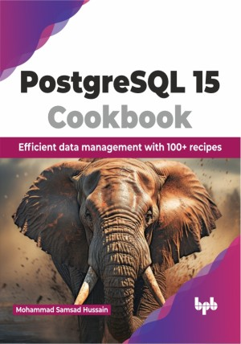

# PostgreSQL 15 Cookbook

Level up database administration with PostgreSQL 15 recipes for mastery

This is the repository for [PostgreSQL 15 Cookbook
](https://bpbonline.com/products/postgresql-15-cookbook?variant=43323003994312),published by BPB Publications.

## About the Book
PostgreSQL 15 is a powerful, open-source database system known for its reliability, flexibility, and advanced features. It stores and manages data efficiently, making it ideal for everything from personal projects to large-scale applications.

Get started with installation, configuration, and user management. Learn the basics of tables, views, and functions. Deploy your database securely on AWS, migrate seamlessly from other systems, and explore replication for high availability. Write efficient SQL queries, optimize performance, and safeguard your information with backups and recovery techniques. Control user access, implement robust security measures, and monitor your database health for proactive troubleshooting. Solve common errors and optimize performance, Practical tips and real-world scenarios provide a hands-on learning experience, making it easy to apply new knowledge.

By the end of this book, you will have the confidence and skills to manage data like a pro, tackle challenges with ease, and unleash the full potential of PostgreSQL 15.

## What You Will Learn
• To setup, configure, and manage users with expertise.

• Scale your database to the cloud securely and migrate seamlessly.

• Protect your data, recover from unexpected events. 

• Control access, implement robust security measures, and monitor your database's health.

• Troubleshooting, problem-solving, and fixing common errors.
